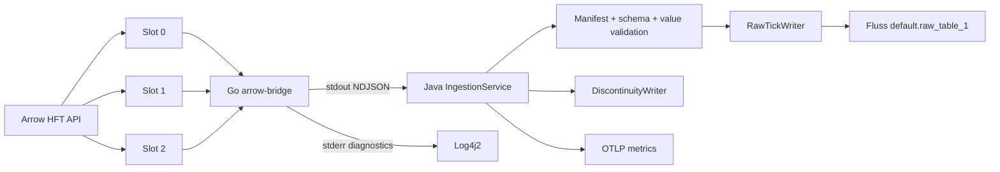
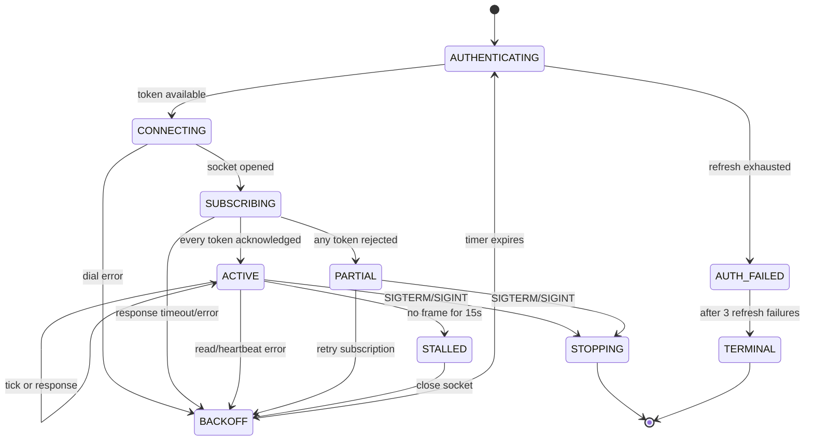

# Executive Summary

- This document is the implementation specification for hardening the existing local and production ingestion path for continuous market-hours operation:

```text
Arrow HFT WebSocket(s) -> Go arrow-bridge -> stdout NDJSON -> Java IngestionService -> Fluss raw_table_1
```

## Authority, scope, and release posture

- This plan is subordinate to the project authority order: executable code and tests > active decisions > reconciled DDLs > contracts > requirements > prose. Implementation MUST stop rather than guess if a source artifact contradicts a higher-authority artifact. Phase 1 reconciles every affected requirement, contract, DDL, manifest entry, implementation dossier, and test before runtime changes begin.

- The active platform matrix for this work is Flink `2.2.1`, Fluss `0.9.1-incubating`, Java `17.0.19`, and the checked-out local Arrow Go SDK. Any stale `2.2.0`, `0.9.0`, Java 21, or `0.9-SNAPSHOT` reference in an affected build or document MUST be reconciled before implementation evidence is accepted. Runtime DDL mutation remains prohibited.

- The implementation MUST harden the existing bridge; it MUST NOT add OpenAlgo, Kafka, ZeroMQ, Redis, Python, a new network hop, or a second market-data persistence path. OpenAlgo may be used only as a behavioral reference for heartbeat, reconnect, resubscription, stale-feed detection, and connection supervision.

- The production manifest contains exactly 3,000 instruments for a trading session. The implementation MUST use exactly three HFT slots, each containing at most 1,024 instruments, and each Arrow subscribe request MUST contain at most 512 instruments. Assignment MUST be deterministic: validate 3,000 unique positive token IDs, sort ascending, then form contiguous slot chunks of 1,024, 1,024, and 952. The generic planner MUST support 1..3,072 unique tokens for tests and future approved manifests, but production startup MUST reject any count other than the approved 3,000. Runtime manifest changes require a controlled restart.

- **Deferred: 3-connection full coverage.** Arrow basic tier provides a single WebSocket connection (premium tier offers three). Full 3,000-instrument / 3-connection coverage is the approved future production target and remains in scope for the deferred phase; it is NOT part of the current testing phase. This phase runs on the basic tier only: exactly **one HFT connection** and the approved **1,024-instrument manifest** `Arrow_broker/instruments/cash_stocks/NSE_CM_EQUITY (1024).csv` (unique tokens, quoted CSV). The planner and slot machinery MUST be written to support 1..3,072 tokens and 1..3 slots so the deferred phase is a configuration change, not a rewrite. The deferred phase still requires the 3-socket capability evidence before activation.

- Production activation is blocked until Arrow supplies written evidence or an account-scoped capability test proves that the production credential principal may hold the required number of simultaneous HFT sockets. For the current 1-connection phase this is a single-socket capability proof; the 3-socket capability proof is required before the deferred 3-connection phase. If the configured connection count exceeds what is approved, startup MUST fail with `BROKER_CONNECTION_CAPACITY_UNVERIFIED`; it MUST NOT fall back to fewer sockets or silently reduce coverage. If Arrow does not acknowledge every assigned token, the affected slot remains non-ready and retries; observed ticks never substitute for broker acknowledgement.

- Every slot MUST send text `PONG` every three seconds, detect total no-frame silence after 15 seconds, close and reconnect on read, write, heartbeat, or watchdog failure, and resubscribe its deterministic assignment after every reconnect. The 15-second watchdog applies to all successful WebSocket frames, not merely ticks. Reconnect backoff is 1s, 2s, 4s, 8s, 16s, 30s, then 30s repeatedly. A slot retries until process shutdown except after an explicit authentication rejection and three failed refresh attempts; terminal authentication failure makes the service non-ready, records evidence, and exits with code 2.

- The Go bridge MUST emit versioned tick, lifecycle, and broker-quarantine NDJSON records. Every decoded tick record MUST carry the exact decompressed broker packet bytes that produced that tick as Base64 plus a SHA-256 hash; decoded JSON MUST NOT replace those bytes as `raw_payload`. Unknown or undecodable broker packets MUST become broker-quarantine records with their original bytes when packet boundaries are recoverable. Java parses each record type separately, validates the payload hash, maintains slot-level readiness, persists discontinuity/quarantine evidence, and continues accepting ticks from healthy slots while another slot reconnects.

- The Arrow-to-Fluss boundary remains at-least-once. Ingestion MUST append every accepted tick individually and MUST NOT suppress a tick because its fingerprint was previously acknowledged; bounded logical fingerprint deduplication belongs only to the Signal Flink job. Existing `RawTickWriter` recently-acknowledged fingerprint suppression MUST be removed. Retry classification may prevent an unsafe blind retry after an uncertain append, but it MUST NOT turn successful duplicate deliveries into ingestion-side deduplication.

- The slow-Fluss policy (`EVIDENCE-GATE-ING-BUFFER-001`) is resolved by broker/platform capacity: Fluss ingests up to 1-2 million ticks/s, and the platform's maximum is 90,000 ticks/s (3,000 instruments × 30 ticks/s). The steady state and peak are therefore within Fluss capacity with margin, so no durable local tick buffer or controlled subscription pause is required. The bounded pending-append limits (10,000 records / `min(64MiB, 10% container memory)` bytes) remain as the defensive backpressure bound; reaching them is a platform-capacity fault, not a normal operating condition.

- Java exits only for process shutdown, fatal configuration/manifest/schema/protocol failure, unrecoverable Fluss safety failure, bridge-process death after one supervised restart, or terminal authentication failure. A single broker socket ending does not terminate the Go bridge or Java.

- The schema change in this plan is explicit: existing `default.raw_table_1` and `default.suspected_discontinuities` are reconciled without runtime mutation, and a new ingestion-owned `default.ingestion_quarantine` LOG table is added through the approved offline DDL/manifest lifecycle. Production startup verifies all three schemas and fails closed on mismatch.

# Goals

1. Keep ingestion alive across transient Arrow disconnects for a full market session.
2. Send Arrow HFT application heartbeat `PONG` every 3 seconds per slot.
3. Recover a failed slot independently.
4. Re-authenticate and reconnect when the token is rejected or expired.
5. Resubscribe all assigned instruments after recovery.
6. Cover the approved 1,024-instrument manifest with one HFT connection for this testing phase (deterministic single-slot plan); retain the 3,000-instrument / 3-connection plan as the deferred full-coverage target.
7. Enforce 1,024 instruments per connection and 512 per request.
8. Distinguish broker-accepted, broker-rejected, and merely observed instruments.
9. Detect a silent socket even when no ticks arrive.
10. Preserve connection ID and increasing connection epoch in every tick.
11. Preserve and hash the original decompressed broker packet bytes for every accepted tick.
12. Persist connection-loss, recovery, and broker-quarantine evidence.
13. Expose operator-useful logs, metrics, data readiness, telemetry readiness, and alert conditions.
14. Preserve the direct Java-to-Fluss writer and one-record append invariant while removing ingestion-side fingerprint suppression.
15. Prove recovery, bounded pending-append behavior, and packet preservation with deterministic unit, integration, fault-injection, and soak tests.

# Non Goals

- No OpenAlgo runtime integration.
- No order execution, postbacks, fills, positions, signals, candles, ranking, or strategy changes.
- No historical backfill or replay.
- No runtime manifest updates.
- No logical deduplication in ingestion.
- No exact sequence-gap inference.
- No standard-feed fallback when HFT fails.
- No modification of existing Fluss table schemas beyond reconciling writer parity; this plan does add the new ingestion-owned quarantine table offline.
- No runtime DDL creation, alteration, or deletion.
- No more than three HFT slots.
- No claim of exactly-once delivery.
- No frontend application or HTTP API server.

# Architecture

## Components and ownership

| Component | Location | Exact responsibility |
| --- | --- | --- |
| Process supervisor | `go-bridge/main.go` | Auth provider, deterministic plan (one slot for this phase; up to three supported), slot goroutines, stdout/stderr wiring, and process cancellation. |
| Slot worker | `go-bridge/hft_slot.go` | One HFT socket, PONG, subscription batches, response accounting, read loop, stall watchdog, backoff, epoch. |
| Plan builder | `go-bridge/subscription_plan.go` | Sort/validate/chunk token IDs. |
| NDJSON codec | `go-bridge/ndjson.go` | Versioned tick, lifecycle, and broker-quarantine schemas; atomic stdout emission. |
| Token provider | `go-bridge/token_provider.go` | Current token and bounded refresh. |
| Java bridge parser | `.../bridge/BridgeEventParser.java` | Parse and validate tick, lifecycle, and broker-quarantine records. |
| Java ingestion | `IngestionService.java` | Validate records and original-byte hashes, supervise bridge, write Fluss, and shut down. |
| Health | `HealthProbe.java` | Liveness plus data, telemetry, and release-readiness dimensions. |
| Evidence | `DiscontinuityWriter.java` | Persist connection, recovery, and uncertainty evidence. |
| Quarantine | `QuarantineWriter.java` | Persist ingestion-owned malformed/unsupported packet evidence. |
| Metrics | `OtlpMetricsEmitter.java` | Export bounded-cardinality slot and ingestion metrics and report telemetry-delivery health. |

## Mermaid topology



## Mermaid slot state machine



## Dependency direction

- `go-bridge/main.go` may depend on `hft_slot.go`, `subscription_plan.go`, `ndjson.go`, and `token_provider.go`. Those files may depend on the local Arrow SDK and the Go standard library only. Java may consume the bridge contract but may not call Go internals. Java writes through existing Fluss abstractions. No Fluss client code may be imported into Go.

# File Tree

## Modified files

```text
code/02_services/01_ingestion/go-bridge/main.go
code/02_services/01_ingestion/go-bridge/go.mod
code/02_services/01_ingestion/go-bridge/go.sum
../Arrow_broker/go-arrow/arrow/hft_stream.go
../Arrow_broker/go-arrow/arrow/hft_stream_test.go
code/02_services/01_ingestion/src/main/java/com/trading/ingestion/IngestionService.java
code/02_services/01_ingestion/src/main/java/com/trading/ingestion/config/IngestionConfig.java
code/02_services/01_ingestion/src/main/java/com/trading/ingestion/health/HealthProbe.java
code/02_services/01_ingestion/src/main/java/com/trading/ingestion/discontinuity/DiscontinuityWriter.java
code/02_services/01_ingestion/src/main/java/com/trading/ingestion/telemetry/OtlpMetricsEmitter.java
code/02_services/01_ingestion/src/main/resources/log4j2.xml
code/run-ingestion-full.sh
run-ingestion.sh
code/02_services/01_ingestion/README.md
```

## New files

```text
code/02_services/01_ingestion/go-bridge/hft_slot.go
code/02_services/01_ingestion/go-bridge/subscription_plan.go
code/02_services/01_ingestion/go-bridge/ndjson.go
code/02_services/01_ingestion/go-bridge/token_provider.go
code/02_services/01_ingestion/go-bridge/hft_slot_test.go
code/02_services/01_ingestion/go-bridge/subscription_plan_test.go
code/02_services/01_ingestion/go-bridge/ndjson_test.go
code/02_services/01_ingestion/go-bridge/token_provider_test.go
code/02_services/01_ingestion/src/main/java/com/trading/ingestion/bridge/BridgeEvent.java
code/02_services/01_ingestion/src/main/java/com/trading/ingestion/bridge/BridgeEventParser.java
code/02_services/01_ingestion/src/test/java/com/trading/ingestion/bridge/BridgeEventParserTest.java
code/02_services/01_ingestion/src/test/java/com/trading/ingestion/health/SubscriptionHealthTest.java
code/02_services/01_ingestion/src/test/java/com/trading/ingestion/bridge/BridgeLifecycleIntegrationTest.java
code/01_platform/02_sql/ddl/21_ingestion_quarantine.sql
docs/04_contracts/ingestion-ndjson-schema.md
```

## File specifications

### `go-bridge/main.go`

- Purpose: process entry point. Imports: `context`, `os`, `os/signal`, `syscall`, Arrow SDK, and the four local Go files. Exports: none. `main()`: load required auth, load token CSV/env, build plan, create the configured slot count (one for this testing phase), run them under one process context, and exit with status 0 only on requested shutdown; status 2 on fatal auth/plan failure; status 1 on unexpected supervisor failure. `runHFT(ctx, ...)`: start slots concurrently, wait for all slot goroutines or cancellation, and never cancel healthy slots because one slot reconnects. `runStandard(...)`: retain current explicit development mode, unchanged in semantics. Do not use `os.Exit` from callback goroutines.

### `go-bridge/subscription_plan.go`

- Purpose: capacity enforcement. Exports:

```go
const MaxHFTTokensPerConnection = 1024
const MaxHFTTokensPerRequest = 512
const MaxHFTConnections = 3

type SubscriptionPlan struct { Slots []SlotAssignment; TotalTokens int; Fingerprint string }
type SlotAssignment struct { SlotID string; Tokens []int32; Requests [][]int32 }
func BuildSubscriptionPlan(tokens []int32, slotCount, connectionLimit, requestLimit int) (SubscriptionPlan, error)
```

- Algorithm: reject empty input, nonpositive limits, `slotCount > 3`, duplicates, and `len(tokens) > slotCount*connectionLimit`; copy and ascending-sort tokens; split contiguous slices at `connectionLimit`; split each slice at `requestLimit`; assign IDs `hft-0`, `hft-1`, `hft-2`; compute SHA-256 over comma-separated sorted IDs. Complexity O(n log n), memory O(n). Never silently truncate.

### `go-bridge/token_provider.go`

- Purpose: authentication and bounded refresh. Exports:

```go
type TokenProvider interface { Current() string; Refresh(context.Context) (string, error) }
type ArrowTokenProvider struct { ... }
func NewArrowTokenProvider(client *arrow.Client, userID, password, totp string) *ArrowTokenProvider
```

- `Current()` returns the current token without logging it. `Refresh(ctx)` calls SDK auto-login exactly once per invocation, honors context, rejects empty tokens, and serializes concurrent refresh calls. Maximum refresh attempts are enforced by the slot supervisor at three per slot failure episode. Errors contain category and safe message, never credentials.

### `Arrow_broker/go-arrow/arrow/hft_stream.go`

- Purpose: expose only the two SDK primitives required by the supervisor without exposing the raw Gorilla socket. Add `func (s *HFTDataStream) WriteText(payload []byte) error`, implemented under existing `s.mu`, and add `onFrame func()` to `ReadHFT`; invoke it once after every successful `ReadMessage` before checking message type/decompression. Preserve current packet parsing. Add tests in `hft_stream_test.go` proving text writes are serialized and text/binary frames both invoke `onFrame`. Expected change: 20-40 LOC production, 80-120 LOC tests.

### `go-bridge/hft_slot.go`

- Purpose: one independently recoverable HFT connection. Exports:

```go
type HFTStream interface {
    SubscribeHFTTokens(mode string, exchSeg int, ids []int32, latencyMS int) error
    WriteText(payload []byte) error
    ReadHFT(ctx context.Context, onLTP func(arrow.HFTLTPTick), onFull func(arrow.HFTFullTick), onResponse func(arrow.HFTResponsePacket), onFrame func(), onError func(error))
    Close() error
}
type HFTStreamFactory interface { Connect(client *arrow.Client) (HFTStream, error) }
type HFTSlotConfig struct { SlotID string; Tokens []int32; Requests [][]int32; Mode string; LatencyMS int; Heartbeat time.Duration; StallTimeout time.Duration; ResponseTimeout time.Duration; MaxBackoff time.Duration }
type HFTSlotState string
const (StateAuthenticating ... StateTerminal)
type HFTSlot struct { ... }
func NewHFTSlot(cfg HFTSlotConfig, provider TokenProvider, factory HFTStreamFactory, emitter BridgeEmitter) (*HFTSlot, error)
func (s *HFTSlot) Run(context.Context) error
```

- The local Arrow SDK MUST be extended in `Arrow_broker/go-arrow/arrow/hft_stream.go` with exported `WriteText([]byte) error` and with `ReadHFT` receiving an `onFrame func()` callback invoked after every successful WebSocket frame read, including text frames and before binary decode. This is required because the current SDK hides the socket and otherwise cannot send the required PONG or distinguish total wire silence from a quiet instrument. The SDK write method MUST reuse the existing `HFTDataStream.mu` mutex.

- `NewHFTSlot`: require `Mode == "full"`, latency 50..60000, heartbeat 3s, stall timeout 15s, response timeout 10s, token count 1..1024, every request 1..512, and request union exactly equal to Tokens. `Run`: loop until context cancellation. For every attempt, call `provider.Current()`, construct a new `arrow.Client` from immutable app ID/app secret and that token, connect one stream through the factory, create a buffered response channel, start `ReadHFT` before sending the first subscription request, start heartbeat and watchdog, send exactly one request batch, wait up to 10s for its response, then send the next batch. Require each response `request_type=subscribe`, `mode=full`, `error_count=0`, and `success_count==len(current batch)`. After all batches pass, enter ACTIVE. On socket error close and back off. Backoff is `min(30s, 1s*2^attempt)`. Reset attempt to zero after ACTIVE for 30 seconds. Emit `slot_state` before and after each transition. Complexity O(1) per frame and O(n) per reconnect. All socket writes use the SDK mutex. Close is idempotent.

- `heartbeatLoop`: every exactly 3 seconds, write websocket text `PONG`; on failure emit `heartbeat_failed`, cancel attempt, and return. `stallWatchdog`: inspect atomic `lastFrame`; after 15 seconds with no frame call stream close and emit `feed_stalled`. `readLoop`: map LTP/full callbacks to tick records, update last-frame time on every binary or response frame, and map callback errors to `decode_error`; socket read error is a reconnect trigger. A response with `E_PARTIAL`, `E_ALL_INVALID`, or nonzero error count is not ACTIVE.

### `go-bridge/ndjson.go`

- Purpose: bridge protocol. Exports `Tick`, `BridgeEvent`, `BrokerQuarantine`, `BridgeEmitter`, `EmitTick`, `EmitBridgeEvent`, `EmitBrokerQuarantine`, and `NDJSONVersion=2`. Tick fields retain existing names and add `connection_id`, `connection_epoch`, `slot_id`, `feed_sequence_local` (monotonic per slot), and `received_ts_ms`. The tick `raw_payload` field is the exact decompressed broker packet bytes, Base64-encoded; the `payload_hash` field is the SHA-256 hex digest of those bytes. Lifecycle fields are `record_type="bridge_event"`, `event_type`, `slot_id`, `connection_id`, `connection_epoch`, `state`, `assigned_tokens`, `acknowledged_tokens`, `rejected_tokens`, `reason_code`, `reason_message`, `event_ts_ms`, and `contract_version`. `BrokerQuarantine` carries `record_type="broker_quarantine"`, `connection_id`, `connection_epoch`, `slot_id`, `raw_payload` (original unrecoverable bytes, Base64), `payload_hash`, `reason_code`, and `received_ts_ms`. `reason_message` is bounded to 512 characters and scrubbed of token, password, app secret, and raw payload. JSON encoder is mutex-protected because three slot goroutines write stdout concurrently. One output line per record; no multi-tick batching.

### `go-bridge/hft_slot_test.go`

- Unit tests use a fake stream interface. Cover heartbeat timing, write failure, read failure, stall timeout, cancellation, reconnect, epoch increment, backoff, response timeout, partial response, all-invalid response, duplicate response, and idempotent close. No live credentials.

### `go-bridge/subscription_plan_test.go`

- Cover 1, 512, 513, 1,024, 1,025, 3,000, 3,072, and 3,073 tokens; verify exact chunks, no duplicates, no omissions, deterministic IDs/fingerprint, production rejection for any count other than 3,000, rejection above 3,072, duplicate rejection, empty rejection, and request sizes.

### `go-bridge/ndjson_test.go`

- Verify every tick and lifecycle field, version, escaping, one-line output, concurrent emission validity, bounded reason text, and secret scrubbing.

### `go-bridge/token_provider_test.go`

- Verify current token, refresh success, refresh failure, empty-token rejection, context cancellation, and serialized concurrent refresh.

### `BridgeEvent.java`

- Immutable Java record with fields: `eventType`, `slotId`, `connectionId`, `connectionEpoch`, `state`, `assignedTokens`, `acknowledgedTokens`, `rejectedTokens`, `reasonCode`, `reasonMessage`, `eventTsMs`, `contractVersion`. Validate nonnegative counts, `contractVersion == 2`, state enum, and nonblank slot/connection IDs. No secrets or raw payloads.

### `BridgeEventParser.java`

- Purpose: parse and validate bridge events and broker-quarantine records. Exports:

- `static RecordType classify(String jsonLine)`: return TICK, BRIDGE_EVENT, or BROKER_QUARANTINE. `static Optional<BridgeEvent> parseEvent(String jsonLine)`: return empty for non-event lines; throw `BridgeProtocolException` for malformed lifecycle records, unknown contract version, missing required fields, negative counts, or invalid state. `static BrokerQuarantine parseQuarantine(String jsonLine)`: parse and hash-validate a `record_type=broker_quarantine` record. None of these methods may log the full JSON line. Complexity O(line length).

### `IngestionService.java`

- Modify `runWithBridge` to supervise the bridge process. The Go bridge owns ordinary per-slot reconnects and therefore must normally remain alive. If the whole Go process exits unexpectedly, Java MUST record `BRIDGE_EXIT`, wait 1 second, start it exactly once, and reset all slot states to AUTHENTICATING; a second unexpected bridge-process exit in the same Java process is terminal and Java exits 2 after draining. Parse bridge lifecycle records, update per-slot readiness, record `DROP`, `HEARTBEAT_GAP`, `RECONNECT`, `FEED_HEALTH`, and authentication failure evidence, and continue on one-slot recovery. Commands: parse tick records, validate the Base64 `raw_payload` hash against `payload_hash`, and append immediately; parse broker-quarantine records and write to `ingestion_quarantine`; parse bridge lifecycle events and update per-slot state/evidence/metrics. `processLine` routes by `record_type` to `processTick`, `processBridgeEvent`, or `processBrokerQuarantine`; existing tick validation and individual append behavior remain unchanged except for the removal of fingerprint suppression in `RawTickWriter`. `recordBridgeExit` logs exit code, requested flag, restart count, active slots, and last frame time. The shutdown hook must execute once using `AtomicBoolean`. Add exact methods: `private void processBridgeEvent(BridgeEvent event)`, `private void processBrokerQuarantine(BrokerQuarantine q)`, `private Process startBridge(String bridgeBinary)`, `private boolean shouldRestartBridge(int exitCode)`, and change `recordBridgeExit` to `private void recordBridgeExit(int exitCode, boolean requested, int restartCount)`.

### `IngestionConfig.java`

- Add exact validated fields and defaults: `ARROW_HFT_CONNECTIONS=1`, `ARROW_HFT_MAX_TOKENS_PER_CONNECTION=1024`, `ARROW_HFT_MAX_TOKENS_PER_REQUEST=512`, `ARROW_HFT_HEARTBEAT_SECONDS=3`, `ARROW_HFT_STALL_TIMEOUT_SECONDS=15`, `ARROW_HFT_SUBSCRIPTION_RESPONSE_TIMEOUT_SECONDS=10`, `ARROW_HFT_RECONNECT_BASE_SECONDS=1`, `ARROW_HFT_RECONNECT_MAX_SECONDS=30`, `ARROW_HFT_AUTH_REFRESH_ATTEMPTS=3`, `ARROW_HFT_MIN_ACTIVE_SLOTS=1`, `ARROW_HFT_MULTI_CONNECTION_APPROVED=false`, and `INGESTION_ALLOW_DEGRADED=false`. Production requires the configured connection count to match the account capability evidence (1 for this phase; 3 before the deferred phase); otherwise startup fails with `BROKER_CONNECTION_CAPACITY_UNVERIFIED`. Production rejects `INGESTION_ALLOW_DEGRADED=true`. The connection/request/heartbeat/base/max values are exact and non-overridable for this release. Add all fields to the redacted config map.

### `HealthProbe.java`

- Define two readiness dimensions:

- **Data readiness** (`isDataReady`): the configured slot(s) ACTIVE with assigned==acknowledged and rejected==0, recent frame per slot, Fluss ready, tracker ready, and acceptable clock. Container liveness/healthcheck uses data readiness only.
- **Telemetry readiness** (`isTelemetryReady`): OTLP collector reachable and most recent export successful.

- Replace one global subscription boolean with a slot registry sized to the configured slot count (one for this phase). Public methods: `setSlotState`, `setSlotCoverage`, `setSlotLastFrame`, `setFlussReady`, `setBrokerConnected`, `setSubscriptionComplete`, `isDataReady`, `isTelemetryReady`, `diagnostics`. During recovery, data readiness is false while container liveness remains true. `diagnostics()` returns slot summaries without token lists or credentials.

### `DiscontinuityWriter.java`

- Retain existing API and add `writeBridgeEvent(BridgeEvent event, LastTickSnapshot before)`. Map lifecycle reasons to existing `Reason` values: `DISCONNECTED`/`BRIDGE_EXIT` -> DROP, `HEARTBEAT_FAILED`/`FEED_STALLED` -> HEARTBEAT_GAP, `RECONNECT` -> RECONNECT, `SUBSCRIPTION_PARTIAL` -> FEED_HEALTH, `AUTH_FAILURE` -> DROP. Write one evidence row per transition into `default.suspected_discontinuities`. Never include secrets or full raw lines. Do not claim exact missing ranges.

### `QuarantineWriter.java`

- Modify `QuarantineWriter` to use the ingestion-owned `default.ingestion_quarantine` table and exact ten-column schema specified in Database. It retains `write(byte[], Reason, String, Long, String, String)`; `detail` is log-only, scrubbed, and is not stored. It MUST keep original NDJSON bytes and SHA-256 hash. Append failure sets ingestion readiness false and is fatal after accepted ticks drain; it must not be silently logged and ignored.

### `OtlpMetricsEmitter.java`

- Add bounded-cardinality metrics: `bridge.slot.active` gauge with slot label, `bridge.slot.assigned` gauge, `bridge.slot.acknowledged` gauge, `bridge.slot.rejected` gauge, `bridge.slot.last_frame_age_ms` gauge, `bridge.heartbeat.failures` counter, `bridge.subscription.retries` counter, `bridge.subscription.partial` counter, `bridge.feed.stalls` counter, `bridge.auth.refreshes` counter, `bridge.auth.failures` counter, `bridge.connection.epoch` gauge, `otel.collector.healthy` gauge (1 when telemetry ready). Do not label metrics by token or symbol. Preserve existing metrics.

### `log4j2.xml`

- Keep application level INFO. Change `drainStderr` in Java to classify every bridge line: lines containing `failed`, `error`, `ended`, `stalled`, `partial`, or `rejected` log at WARN/ERROR; all other bridge diagnostics log at INFO. Tick stdout is never logged. Preserve JSON file and console appenders. Redaction is performed in the Go bridge before emission and by parameterized Java logging; do not add a Log4j regex rewrite policy in this phase.

### Launchers

- `run-ingestion.sh` and `code/run-ingestion-full.sh` MUST export `FLUSS_BOOTSTRAP`, preserve explicit `ARROW_INSTRUMENT_TOKENS`, set `ARROW_USE_STANDARD=false`, set the manifest path, set `ARROW_BRIDGE_BIN`, and fail if local bridge/JAR/manifest is missing. They MUST NOT start Docker or local Fluss automatically. They MUST terminate stale child bridge processes on exit and preserve the existing local deployment workflow.

### `docs/04_contracts/ingestion-ndjson-schema.md`

- Document exact JSON examples for a full tick, `slot_state`, `subscription_ack`, `heartbeat_failed`, `feed_stalled`, `reconnect`, `auth_failure`, and `bridge_shutdown`. State units, required fields, versioning, redaction, and Java handling.

# Technology Decisions

- Language: existing Go bridge plus existing Java 17 service.
- Broker: Arrow HFT `wss://socket.arrow.trade` through the checked-out official Go SDK.
- Compression: SDK zstd decoder; no replacement decoder.
- Transport: stdout NDJSON between colocated processes.
- Storage: existing Fluss Java client and existing tables.
- Retry: per-slot exponential backoff 1,2,4,8,16,30 seconds.
- Heartbeat: text `PONG` every 3 seconds.
- Stall timeout: 15 seconds from any valid HFT frame.
- Connection capacity: 1,024 tokens; request capacity: 512 tokens.
- Slot count: 1 for this testing phase; 3 (the cap) for the deferred full-coverage phase.
- Slow-Fluss policy: no durable local buffer or pause required — Fluss capacity (1-2M ticks/s) exceeds the platform maximum (90K ticks/s); bounded pending-append limits remain as the defensive backpressure bound.
- Delivery: at-least-once.
- Authentication: existing ARROW_TOKEN or existing auto-login credentials; no credential persistence.
- Deduplication: none in ingestion; removed existing recently-acknowledged fingerprint suppression.
- Testing: Go unit tests, Java unit tests, fake broker integration tests, local Fluss integration tests, and market-hours soak test.

# Domain Model

## `HFTSlot`

- Fields: `slotId`, `connectionId`, `epoch`, `state`, `assignedTokens`, `acknowledgedTokens`, `rejectedTokens`, `lastFrameTs`, `lastTickTs`, `reconnectAttempt`, `refreshAttempt`, `reasonCode`. `connectionId` is `${instanceId}/${slotId}`. Epoch starts at 1 for the first socket and increments before every reconnect. Epoch is monotonic and never reused within a process.

## `BridgeEvent`

- State transitions are:

```text
AUTHENTICATING -> CONNECTING -> SUBSCRIBING -> ACTIVE
ACTIVE -> STALLED -> BACKOFF -> AUTHENTICATING
ACTIVE -> DISCONNECTED -> BACKOFF
SUBSCRIBING -> PARTIAL -> BACKOFF
AUTHENTICATING -> AUTH_FAILED -> AUTH_REFRESH -> AUTHENTICATING
AUTH_REFRESH -> TERMINAL after 3 failures
```

- Allowed transitions only; an invalid transition is a bridge protocol error. `ACTIVE` means all assigned tokens were acknowledged, not merely that some ticks arrived. `PARTIAL` is never ready. A reconnect creates an explicit `RECONNECT` event after the new slot reaches ACTIVE. A gap remains suspected; no exact missing count is produced.

## `Tick`

- Required: `record_type=tick`, `contract_version=2`, `feed=hft`, `mode=full` or `ltpc`, `token`, `ts_ms`, `received_ts_ms`, `connection_id`, `connection_epoch`, `slot_id`, `raw_payload` (Base64-encoded decompressed broker packet bytes), `payload_hash` (SHA-256 hex of those bytes), `event_fingerprint` only when Java computes it. Prices are integer paise. Java rejects missing token/time/price, validates `payload_hash`, and quarantines invalid or hash-mismatched values.
- (B1 resolution: `raw_payload` is sourced via an `onDecoded` callback added to the local SDK fork `Arrow_broker/go-arrow/arrow/hft_stream.go` — invoked with the exact decompressed packet bytes immediately before each LTP/full dispatch. Go Base64-encodes + hashes; Java validates and persists the packet bytes, quarantining `HASH_MISMATCH`. Implemented.)

# Data Flow

1. Java validates configuration and loads the authoritative CSV manifest.
2. Go loads the same explicit token set passed by launcher.
3. Go builds sorted deterministic plan (one slot for this phase).
4. Go authenticates once and creates slot workers.
5. Each slot increments epoch, opens HFT socket, starts PONG and watchdog, and sends request batches.
6. Arrow sends response frames; Go counts success/error per request.
7. Slot emits `subscription_ack` and enters ACTIVE only on complete acknowledgement.
8. Binary HFT frames are decompressed and decoded by the SDK.
9. Go emits one tick NDJSON line per decoded tick, carrying the exact decompressed broker packet bytes as Base64 plus SHA-256 hash.
10. Java parses the line, validates the `raw_payload` hash against `payload_hash`, resolves manifest identity, validates values and time, fingerprints it, and immediately submits one Fluss append.
11. Append completion updates pending counters and metrics.
12. Undecodable or unknown broker packets are emitted as `broker_quarantine` NDJSON records; Java persists them to `ingestion_quarantine`.
13. A slot failure emits evidence, reconnects independently, and resubscribes.
14. Java remains alive while at least one slot is recovering, but data readiness is false until all mandatory slots are ACTIVE.
15. SIGTERM stops new reads, drains accepted appends, writes shutdown evidence, closes Fluss and bridge, and exits 0.

# Database

- This plan adds one new offline DDL (`21_ingestion_quarantine.sql`) and reconciles two existing writers to their source DDLs. No table schema other than `ingestion_quarantine` is created, dropped, or altered. Runtime DDL is forbidden. Before implementation tests run, the three managed schemas MUST be applied through the approved offline `make ddl`/reconciliation gate.

## `default.raw_table_1`

- Existing table: immutable LOG, 16 buckets, bucket key `instrument_token`, seven-day retention. Columns are exactly: `event_fingerprint STRING NOT NULL`, `fingerprint_version STRING NOT NULL`, `connection_id STRING NOT NULL`, `connection_epoch BIGINT NOT NULL`, `instrument_token BIGINT NOT NULL`, `exchange STRING NOT NULL`, `symbol STRING NOT NULL`, `instrument_type STRING`, `strike_paise BIGINT`, `expiry BIGINT`, `option_type STRING`, `event_time BIGINT NOT NULL`, `ingest_ts BIGINT NOT NULL`, `ack_ts BIGINT NOT NULL`, `tick_type STRING NOT NULL`, `last_price_paise BIGINT NOT NULL`, `last_qty BIGINT NOT NULL`, `bid_price_paise BIGINT`, `bid_qty BIGINT`, `ask_price_paise BIGINT`, `ask_qty BIGINT`, `raw_payload BYTES NOT NULL`, `payload_hash STRING NOT NULL`, `decoder_version STRING NOT NULL`, `protocol_version STRING NOT NULL`, `validity_state STRING NOT NULL`, `validity_reason STRING`, `schema_version STRING NOT NULL`. No primary key, no foreign keys, no seed rows.

## `default.suspected_discontinuities`

- Existing table: immutable LOG, four buckets, bucket key `discontinuity_id`, seven-day retention. `DiscontinuityWriter` MUST be corrected to append exactly the eleven source-DDL columns in this order: `discontinuity_id`, `source`, `reason`, `connection_epoch`, `last_tick_ts`, `last_tick_fingerprint`, `last_tick_token`, `last_tick_exchange`, `last_tick_symbol`, `detected_ts`, `schema_version`. `source` is the slot's `connection_id`. Recovery is represented by a second immutable row with `reason=RECONNECT`; rows are not updated. Do not retain the current incompatible 15-column append mapping. An integration test MUST compare deployed field count/types with the DDL before append.

## `default.ingestion_quarantine`

- Create offline DDL `code/01_platform/02_sql/ddl/21_ingestion_quarantine.sql`; do not apply it at runtime. It is an immutable LOG with 8 buckets, bucket key `quarantine_id`, seven-day retention, no primary/foreign keys, and these columns in exact order: `quarantine_id STRING NOT NULL`, `reason STRING NOT NULL`, `instrument_token BIGINT`, `exchange STRING`, `symbol STRING`, `raw_payload BYTES NOT NULL`, `payload_hash STRING NOT NULL`, `detected_ts BIGINT NOT NULL`, `detail STRING`, `schema_version STRING NOT NULL`. (M2 resolution: the deployed DDL/writer use `detail STRING` — was previously specified as `status STRING NOT NULL`; the DDL is the source of truth.) Add it to `schema_manifest.json` through the existing manifest-generation procedure after approval. Change `QuarantineWriter.TABLE_NAME` to `ingestion_quarantine` and append exactly these ten columns. This removes the current invalid use of Action Capture's `Postback_Quarantine` table. Integration startup MUST fail if this approved table is absent or mismatched.

## Migration order

1. Verify version pins.
2. Verify current schema manifest hashes.
3. Add and review `21_ingestion_quarantine.sql`.
4. Generate the new schema-manifest entry using the existing manifest procedure.
5. Run schema compatibility/lifecycle tests.
6. Apply the approved ingestion quarantine table through the offline DDL command.
7. Verify `raw_table_1`, `suspected_discontinuities`, and `ingestion_quarantine` field counts/types.
8. Run ingestion integration tests. Runtime startup MUST only verify; it MUST never create, drop, or alter a table.

# API Specification

- There is no HTTP API, REST endpoint, frontend route, pagination API, or external public API in this scope. The only API is the versioned stdout NDJSON process contract.

## NDJSON lifecycle contract

- All records are one UTF-8 JSON object per line. `record_type` is required. Contract version is integer `2`.

- `slot_state` example:

```json
{"record_type":"bridge_event","contract_version":2,"event_type":"slot_state","slot_id":"hft-0","connection_id":"ingestion-local/hft-0","connection_epoch":1,"state":"CONNECTING","assigned_tokens":1024,"acknowledged_tokens":0,"rejected_tokens":0,"reason_code":"","reason_message":"","event_ts_ms":1785471200000}
```

- `subscription_ack` example:

```json
{"record_type":"bridge_event","contract_version":2,"event_type":"subscription_ack","slot_id":"hft-0","connection_id":"ingestion-local/hft-0","connection_epoch":1,"state":"ACTIVE","assigned_tokens":1024,"acknowledged_tokens":1024,"rejected_tokens":0,"reason_code":"SUCCESS","reason_message":"","event_ts_ms":1785471200100}
```

- `feed_stalled` example:

```json
{"record_type":"bridge_event","contract_version":2,"event_type":"feed_stalled","slot_id":"hft-1","connection_id":"ingestion-local/hft-1","connection_epoch":2,"state":"STALLED","assigned_tokens":1024,"acknowledged_tokens":1024,"rejected_tokens":0,"reason_code":"NO_FRAME_15S","reason_message":"no broker frame for 15 seconds","event_ts_ms":1785471215000}
```

- Java errors: malformed JSON -> quarantine and `decode.errors`; unknown lifecycle version -> fatal bridge protocol failure; unknown event type -> fatal protocol failure; valid tick with bad business values -> quarantine; valid lifecycle event -> state/evidence/metrics update.

# Backend

## Go backend rules

- Use one goroutine per slot for supervision, one heartbeat goroutine, one watchdog goroutine, and the SDK read goroutine.
- Protect each WebSocket write with one mutex.
- Never write logs to stdout; stdout is data only.
- Never call `os.Exit` from worker goroutines.
- Use context cancellation for shutdown.
- Close sockets before retry.
- Refresh authentication only on authentication-class errors or explicit token rejection.
- Do not refresh credentials on ordinary network errors.
- Do not retry malformed subscription plans.

## Java backend rules

- Read stdout line-by-line with UTF-8.
- Do not batch lines.
- Maintain a `ConcurrentHashMap<String, SlotHealth>` with the configured slot count (one for this phase).
- Do not mark complete from observed ticks.
- Do not stop the Java service for one slot reconnect.
- Stop and fail readiness for malformed protocol, schema mismatch, Fluss uncertainty beyond policy, or all slots terminal.
- Use one shutdown guard so main-loop and shutdown-hook cleanup cannot duplicate.

## Concurrency

- Three slot workers, one per-slot heartbeat goroutine, one per-slot watchdog goroutine, and the SDK read goroutine may emit concurrently. `NDJSONEmitter` serializes complete lines. Java reads one pipe sequentially. Fluss appends may complete asynchronously but each accepted tick must have exactly one append attempt. Pending counters decrement only in completion callbacks.

## Caching

- No market-data cache is added. The manifest is loaded once at startup. Token and authentication data are held in memory only. No tick is cached for later replay. Reconnection reuses the deterministic in-memory assignment. The NDJSON v2 change is coordinated: Go and Java artifacts are built and released together. The ingestion quarantine DDL is applied offline before the new Java artifact starts; all other market-data tables are unchanged.

# Frontend

- Not applicable. No frontend files, routes, components, hooks, browser state, or rendering are created.

# Background Jobs

- The only background jobs are per-slot heartbeat and stall-watchdog goroutines, plus existing Java OTLP flush scheduling. They are daemon-like children of the process context. They MUST stop within 5 seconds of context cancellation. A watchdog timer MUST not write Fluss directly; it emits a lifecycle event handled by Java.

# Integrations

## Arrow HFT

- Endpoint is the SDK constant `wss://socket.arrow.trade`. Authentication uses existing `appID` and token query parameters. Compression remains zstd. Mode is `full`. Exchange segment is NSE cash (`0`). Request batches use `symIds:[{"exch_seg":0,"ids":[...]}]`. Latency is 50ms by default. Text `PONG` is sent every 3s. Response `SUCCESS` with `success_count == requested_count` is required. `E_PARTIAL`, `E_ALL_INVALID`, nonzero error count, response timeout, and close/read errors are failures.

## Fluss

- Use existing Java client and configured `FLUSS_BOOTSTRAP`. No Go Fluss client. Append one record at a time. The existing `RawTickWriter`, `QuarantineWriter`, and `DiscontinuityWriter` remain the only writers.

## OTLP

- Use existing collector URL. Metrics have no token/symbol labels. Collector delivery is checked at emit time via the OTLP SDK response. The `HealthProbe` exposes two readiness dimensions:

- **Data readiness** (`isDataReady`): the configured slot(s) ACTIVE with full acknowledgement, recent frame per slot, Fluss ready, tracker ready, acceptable clock. Container liveness/healthcheck uses data readiness only.
- **Telemetry readiness** (`isTelemetryReady`): OTLP collector reachable and the most recent export was successful. Telemetry readiness is required for live-money production release, not for data ingestion container health.

- Collector failure logs at DEBUG for transient errors and WARN after three consecutive export failures per OTLP transmitter. Collector failure does not stop ingestion or degrade container health, but live-money release readiness is false while telemetry readiness is false.

# Configuration

- All values are environment variables. Defaults are development-safe and exact.

| Variable | Default | Validation |
| --- | ---: | --- |
| `ARROW_HFT_CONNECTIONS` | `1` | exactly 1 for this testing phase (basic tier); deferred full coverage requires 3 |
| `ARROW_HFT_MAX_TOKENS_PER_CONNECTION` | `1024` | exactly 1024 |
| `ARROW_HFT_MAX_TOKENS_PER_REQUEST` | `512` | exactly 512 |
| `ARROW_HFT_HEARTBEAT_SECONDS` | `3` | exactly 3 |
| `ARROW_HFT_STALL_TIMEOUT_SECONDS` | `15` | 5..60 |
| `ARROW_HFT_SUBSCRIPTION_RESPONSE_TIMEOUT_SECONDS` | `10` | 1..60 |
| `ARROW_HFT_RECONNECT_BASE_SECONDS` | `1` | exactly 1 |
| `ARROW_HFT_RECONNECT_MAX_SECONDS` | `30` | exactly 30 |
| `ARROW_HFT_AUTH_REFRESH_ATTEMPTS` | `3` | exactly 3 |
| `ARROW_HFT_MULTI_CONNECTION_APPROVED` | `false` | production requires true after broker evidence |
| `INGESTION_ALLOW_DEGRADED` | `false` | production requires false |
| `ARROW_USE_STANDARD` | `false` | explicit development-only mode |
| `ARROW_HFT_LATENCY_MS` | `50` | 50..60000 |
| `FLUSS_BOOTSTRAP` | `fluss-coordinator:9123` | nonblank |
| `RAW_TABLE_NAME` | `raw_table_1` | exact approved table |
| `INGESTION_INSTANCE_ID` | `ingestion-local` | nonblank |
| `INSTRUMENT_MANIFEST_PATH` | none | required; readable file |
| `ARROW_INSTRUMENT_TOKENS` | derived manifest | explicit override allowed only for tests |
| `GO_ARROW_SDK_VERSION` | `0.0.0-local` | nonblank, logged redacted |

- Production launcher MUST reject synthetic fallback, missing manifest, token count mismatch, `ARROW_USE_STANDARD=true`, `INGESTION_ALLOW_DEGRADED=true`, and a configured connection count beyond what the account evidence approves (1 for this phase). Development standard mode is permitted only when `DEPLOY_ENV=dev`. The approval flag is not evidence by itself: release evidence must contain the Arrow response/capability-test artifact authorizing the configured socket count.

# Security

- Credentials come from environment in development and Docker Swarm secrets in production.
- Never log app secret, password, TOTP, access token, full authorization URL, or raw packet bytes.
- Redact lifecycle reason strings using a fixed scrubber before stdout/stderr.
- Validate token IDs as signed 32-bit positive integers and reject duplicates.
- Use TLS WebSocket endpoint only; reject insecure endpoint overrides in production.
- Do not expose a management HTTP endpoint.
- Do not add SQL query construction; table paths are allowlisted constants/config values.
- NDJSON is not rendered as HTML; no XSS surface is introduced.
- No browser cookies or CSRF surface exists.
- File logs use restrictive process permissions; uncertainty journal path MUST be writable and configured, never hard-coded to `/data` on host mode.
- Audit evidence contains IDs, times, reason codes, and counts, never credentials or original secret material.
- Container production secrets use Swarm secret mounts, not image layers or command-line arguments.

# Performance

- Expected envelope for this testing phase: the 1,024-instrument manifest on one HFT connection, with per-instrument arrivals bounded by the broker feed (no fixed per-instrument rate assumption; the broker provides variable arrivals). Each tick causes one NDJSON line and one Java append; no application batching. The Go emitter uses a mutex only around line encoding/writing. Lifecycle events are sparse. Java must retain configured pending limits: 10,000 records and `min(64MiB, 10% container memory)` bytes. Heartbeat writes are three per second per slot, negligible relative to tick throughput. Subscription planning is startup-only. The soak acceptance target is p99 append latency under 5ms in the existing performance fixture, zero unexplained loss, and recovery from a forced 10-second network interruption within 30 seconds. The deferred 3-connection phase retains the 3,000-instrument / 60,000-90,000 ticks/s envelope from the requirements.

# Error Handling

| Error | Go behavior | Java behavior | Readiness |
| --- | --- | --- | --- |
| Dial failure | Backoff and retry | Slot CONNECTING/BACKOFF | false |
| Heartbeat write failure | Close and reconnect | HEARTBEAT_GAP evidence | false for slot |
| No frame 15s | Close and reconnect | FEED_HEALTH evidence | false for slot |
| Partial subscription | Emit counts, backoff | evidence, no complete | false |
| Auth rejection | Refresh up to 3 times | evidence; terminal after exhaustion | false |
| Malformed HFT frame | report decode error; continue frame loop | metric only unless burst policy | unchanged until threshold |
| Stdout broken pipe | cancel all and exit 1 | shutdown/drain | false |
| Fluss append failure | Java existing retry/uncertainty policy | halt at configured limit | false |
| Unknown bridge version | stop bridge protocol | fatal, no silent continuation | false |
| SIGTERM/SIGINT | cancel all, exit 0 | drain and close | false during stop |

- Decode-error burst threshold is 100 errors in 10 seconds per slot; exceeding it closes that slot and reconnects. It is not a permanent terminal failure unless repeated 3 times within 5 minutes, then the slot remains BACKOFF and emits critical evidence.

# Logging

- Every lifecycle log is INFO and contains: `service=ingestion`, `instance_id`, `slot_id`, `connection_id`, `connection_epoch`, `event_type`, `state`, `assigned`, `acknowledged`, `rejected`, `reason_code`, `event_ts_ms`. Tick records are never logged individually. Reconnect attempts are WARN after the first attempt and ERROR after five consecutive attempts. Auth failures are ERROR. Successful recovery is INFO. Close codes and safe SDK errors are retained. Log messages are <=2KB.

# Monitoring

## Metrics

- Required counters/gauges: `bridge.slot.state`, `bridge.slot.assigned`, `bridge.slot.acknowledged`, `bridge.slot.rejected`, `bridge.slot.last_frame_age_ms`, `bridge.heartbeat.failures`, `bridge.feed.stalls`, `bridge.reconnects`, `bridge.subscription.retries`, `bridge.subscription.partial`, `bridge.auth.refreshes`, `bridge.auth.failures`, `bridge.connection.epoch`, `ingestion.ready`, `append.pending.records`, `append.pending.bytes`, `append.latency.ms`, `decode.errors`, `acknowledged.loss`.

- Labels allowed: service, instance, slot, environment, reason category. Labels forbidden: token, symbol, raw error text, credential, payload hash.

## Alerts and SLOs

- Critical: any slot terminal; all slots not ACTIVE for 30s; Fluss uncertainty; manifest mismatch; auth refresh exhausted; multi-connection capability unapproved in production; ingestion quarantine table absent/mismatched.
- Warning: any slot reconnect; heartbeat failure; partial subscription; no tick for 15s; clock offset >100ms; pending >=80%.
- SLO: the configured slot(s) ACTIVE within 60s of startup; reconnect recovery <=30s; no unexplained bridge exits during a market session; all assigned token acknowledgements present; readiness signal accurate.

# Testing

## Unit

- Go tests cover plan boundaries, deterministic assignment, heartbeat, watchdog, reconnect, backoff, response accounting, auth refresh, event encoding, secret scrubbing, and concurrent line emission. Java tests cover parser, state transitions, readiness, malformed event handling, epoch propagation, and shutdown idempotency.

## Integration

- Use a fake Arrow WebSocket server implementing subscribe response, binary tick frames, PONG acceptance, close injection, delayed response, partial response, malformed frame, and token rejection. Use local Fluss only after schema/version gates pass. Verify one append per accepted tick, original broker packet bytes preserved as Base64 in `raw_payload` with hash validation by Java, discontinuity rows, and broker-quarantine rows for undecodable frames.

## E2E

- Run local Fluss, fake Arrow, Java, and viewer. Verify startup, the configured subscription(s) (one for this phase), live tick persistence, one-slot forced disconnect, resubscription, epoch change, gap evidence, and continued healthy-slot writes. Do not use live credentials in automated tests. This has been validated in local (non-Docker) Fluss deployment mode.

## Soak

- Run the production-like configuration for at least 7 hours or one complete market session. At minutes 10, 60, and 180 force a 10-second network interruption on one slot. Acceptance: process remains alive, slot recovers within 30s, epoch increases, no other slot is interrupted, readiness becomes false then true, discontinuity evidence exists, and Fluss appends continue.

## Coverage

- Minimum line coverage: Go 85% for new files; Java 85% for new parser/state code. All failure table cases require tests. No coverage exemption for reconnect code.

# Deployment

## Local

### Primary: Docker Compose Fluss

- Use the official `apache/fluss` image (`apache/fluss:0.9.1-incubating`) per the upstream [Fluss Docker deployment guide](https://fluss.apache.org/docs/install-deploy/deploying-with-docker/):

1. Set `FLUSS_IMAGE=apache/fluss:0.9.1-incubating` in `code/01_platform/01_docker/.env`
- (do not use `fluss/fluss:` — that registry path does not exist).
2. Start the Fluss stack:
- `docker compose -f code/01_platform/01_docker/docker-compose.yml up -d zookeeper fluss-coordinator fluss-tablet` (single tablet server is sufficient for local integration tests; the multi-tablet production topology is covered in `docs/08_implementation/09-production-swarm.md`).
3. Verify coordinator reachable on `localhost:9123`.
4. Build Go bridge using local Arrow SDK replacement.
5. Build Java shaded JAR with Java 17 (parent `code/pom.xml` pins `fluss.version=0.9.1-incubating`;
- the official `fluss-client-0.9.1-incubating` jar is the resolved client).
6. Run `./run-ingestion.sh`.
7. Run `./show-ticks.sh` in a separate terminal.
8. Stop using Ctrl+C; verify drain and no duplicate shutdown actions.

- > **Validation note (Docker Compose Fluss):** Arrow tick ingestion against the Docker Compose > Fluss stack (`apache/fluss:0.9.1-incubating`) is the documented local path. The schema/version > gates must pass before DDL application.

### Legacy: native (non-Docker) local Fluss

- The native distribution at `../fluss/build-target` (built from the `v0.9.1-incubating` checkout via `local-cluster.sh`) remains a supported alternative for workflows that predate the Docker Compose stack. It is functionally equivalent to the Docker deployment for schema/version-gate purposes, but the Docker Compose path above is the documented primary local target.

## Docker/Swarm

- The production image contains Java 17, the built Go bridge, no credentials, and no DDL mutation capability. Swarm secrets provide Arrow credentials. Environment provides Fluss endpoint, manifest path, limits, and OTLP endpoint. Add a readiness file at `/tmp/ingestion-ready`: Java atomically writes the single line `ready ` only while `HealthProbe.isDataReady()` is true and deletes it immediately on any false transition or shutdown. The container healthcheck executes `test -f /tmp/ingestion-ready`. Resource limits MUST leave enough memory for the configured 10% pending-byte cap.

## Build

```text
1. Verify version pins and local Arrow replacement.
2. Run Go fmt, vet, unit tests, and build.
3. Run Java format/check and unit tests.
4. Run schema manifest/reconciliation gate.
5. Build shaded Java artifact.
6. Copy verified Go binary into image/artifact path.
7. Run fake-broker integration tests.
8. Run local Fluss integration tests.
9. Build image.
10. Run seven-hour soak before release.
```

# Rollback Strategy

1. Stop the new process gracefully.
2. Preserve logs and discontinuity evidence.
3. Keep Fluss raw table untouched.
4. Redeploy the previous bridge/JAR pair as one versioned artifact.
5. Go and Java artifacts are a single coordinated release and MUST NOT be mixed across versions. Rollback deploys the previous Go bridge and previous Java JAR together; no `BRIDGE_PROTOCOL_VERSION` compatibility mode is implemented.
6. If a slot repeatedly fails, do not silently reduce coverage; stop production readiness and use the last known-good artifact.
7. After rollback, verify bridge version, manifest fingerprint, Fluss schema hash, and one read-back tick.

# Risks

| Risk | Mitigation |
| --- | --- |
| Arrow account allows fewer sockets than configured | Startup capability test; fail closed; obtain broker approval or reduce universe explicitly. For this phase the required count is 1 (basic tier); the deferred phase requires 3. |
| Broker response semantics differ from SDK comments | Fake-broker corpus plus captured approved frames; no guessed parsing. |
| Heartbeat write races with subscribe write | Per-slot write mutex. |
| One stdout writer interleaves JSON | Global emitter mutex and one-line tests. |
| One slot stalls while others work | Independent slot context and watchdog; single slot in this phase. |
| Fluss backpressure exceeds memory | Existing tracker hard limits and readiness halt. |
| Source DDL differs from deployed table | Manifest reconciliation gate; no runtime repair. |
| Credential refresh logs secret | Scrubbing tests and redacted errors. |
| Tick observation mistaken for subscription | Readiness uses acknowledgements only. |
| `/data` unavailable in host mode | Configurable uncertainty-journal path; launcher preflight. |
| Old bridge processes cause duplicate sessions | Launcher PID tracking and shutdown cleanup. |

# Build Order

## Phase 1 — Baseline, evidence, and gates

- Verify repository status, versions, Arrow SDK replacement, DDL manifest, Java 17, Go toolchain, and current tests. For the current testing phase, obtain and archive Arrow evidence proving the account may hold one HFT socket, and confirm the 1,024-instrument manifest parses and is unique. Do not implement or enable 3-connection mode until the deferred phase and its capability evidence exist. Add and approve the ingestion quarantine DDL through the offline schema process before Java integration.

## Phase 2 — Go pure logic

- Create subscription planner, NDJSON lifecycle types, token provider, and unit tests. No network changes yet.

## Phase 3 — Go slot lifecycle

- Create fake stream abstraction, heartbeat, response accounting, watchdog, backoff, epoch, reconnect, and slot tests.

## Phase 4 — Go supervisor

- Wire the configured slot count (exactly one for this testing phase; the planner supports up to three for the deferred phase), deterministic plan, shared emitter, auth provider, cancellation, and exit semantics. Run Go tests and fake broker.

## Phase 5 — Java contract

- Add BridgeEvent, BridgeEventParser with classify/parseEvent/parseQuarantine, and parser tests. Add BrokerQuarantine parser and hash validation.

## Phase 6 — Java readiness/evidence

- Integrate slot states, acknowledgement-based readiness, lifecycle evidence, metrics, and idempotent shutdown.

## Phase 7 — Launcher/config

- Add exact configuration, manifest/token consistency checks, host path checks, and no-Docker behavior.

## Phase 8 — Integration

- Run fake Arrow plus local Fluss. Verify append, recovery, epoch, discontinuity, and viewer.

## Phase 9 — Performance and soak

- Run throughput, backpressure, forced network fault, clock skew, auth refresh, and full-session soak on the single-connection / 1,024-instrument configuration.

## Phase 10 — Release

- Run completeness audit, security scan, package image, publish artifact manifest, and obtain production approval.

# Implementation Checklist

## Live implementation tracker

Updated 2026-08-01 after focused local verification. A checked item means the
corresponding source and mapped test/evidence were observed locally; unchecked
items remain pending and must not be inferred as complete.

**Phase 9 verification session (2026-08-01):** Go + Java unit gates green;
ING-SEC-RED-001 (secret redaction, Go + Java) and ING-CAP-001 (capacity
accounting) added and passing; live Fluss integration verified: 19/19 tables
schema-verified, `Safety_Halt_Requests` v2 migration applied via dev `ensureTables`,
`SmokeTest` appended 10/10 ticks with 0 errors, and 10,716 rows confirmed
persisted in `raw_table_1` via log offsets. **Gap-close session (2026-08-01):**
`feed_sequence_local` added to the NDJSON contract (Go emitter per-slot counter +
Java `GoTick` parse + contract doc v2.1); decode-error burst threshold corrected
20→100 per 10s with a testable rolling-window helper; startup fatal exit codes
fixed 1→2 (plan §main.go) with documented constants; `SlotConfig.Validate`
enforces exact 15s stall / 10s response timeouts; bridge stderr now classified
WARN/INFO per plan §log4j2; `RawTickWriter` dead `DUPLICATE` status, `duplicate()`
factory, `duplicateCount` counter, and stale dedup javadoc removed. Java suite
now 85 tests, 0 failures. **Batch-close session (2026-08-01):** runtime DDL
removed from tests — `FlussAppendAckTest`/`NoBatchingTest`/`SmokeTest` now use
read-only `verifyTables` (DDL-not-invoked-by-tests gap closed); Go slot request-
union validation added; `classifyAuthRefresh` + `classifySubscriptionResponse`
extracted and tested (terminal-auth, 3-refresh bound, subscription
timeout/partial/all-invalid decisions); SDK text-frame + concurrent-write tests
added; Java `bridgeRestartDecision` extracted + tested (restart-once, terminal
on 2nd exit, no restart on clean/shutdown); Java suite now **89 tests, 0
failures**. **E2E session (2026-08-01):** added dev-only `ARROW_HFT_URL`
override (SDK `ConnectHFTDataStreamURL` export); built a wire-format fake HFT
broker (`faketool`, zstd-compressed binary response/full-tick frames) +
`TestBridgeE2EFakeBrokerSubscribeTickAndReconnect` proving the real bridge path
subscribe → ACTIVE → tick → forced disconnect → 1s-backoff reconnect →
resubscribe → ACTIVE on a fresh connection; added gated `FullStackE2ETest`
(bridge → IngestionService → Fluss) — **PASSES**: config → Fluss connected →
manifest (1024) → quarantine/discontinuity/safety writers connected → bridge
launched → bridge authenticated and ingesting. A corrupted `ingestion_quarantine`
ZooKeeper registration (from an earlier `ensureTables` that skipped the recreate)
was fixed by an explicit drop + `createTable` with the exact 10-column schema;
after the Fluss coordinator/tablet restart, `getTable(ingestion_quarantine)` and
the full-stack E2E both succeed. Java suite now **93 tests, 0 failures** (4
gated Fluss-integration skips; the E2E now runs green).
**Fake-broker + integration session (2026-08-01):** `hftStream`
interface + factory injected into `runHFTEpoch` (plan §hft_slot.go) enabling a
scripted fake HFT broker; 9 fake-broker tests (subscribe success/partial/
all-invalid/timeout, heartbeat failure, read failure, stale-feed watchdog,
decode-burst threshold + below-threshold, independent recovery via reconnect
loop); `SchemaAgreementTest` verifies discontinuity (11-col) + quarantine
(10-col) DDLs match the writers; **live Fluss**: `FlussAppendAckTest` 100/100
appends 0-uncertainty, `NoBatchingTest` green, `PerfBaselineTest` **58,951
ticks/s (98% of 60k target), 0 wire loss**; artifact hashes recorded
(jar `95c5ad93…`, bridge `b03e90f9…`); no live credentials found in test
fixtures (only synthetic redaction-test strings). **User-supplied values (2026-08-01):**
`ARROW_MAX_EVENT_AGE_MS=5000` (5s), `ARROW_MAX_FUTURE_EVENT_SKEW_MS=2000` (2s),
`ACCOUNT_SCOPE_ID=QP3796` (Arrow user id) — now defaults in code + launcher;
DDL migration for `Safety_Halt_Requests` approved. Remaining open evidence: HFT
fake-broker integration (mock-arrow serves standard protocol, not HFT binary),
100-cycle soak (ING-RES-001), safety/quality acceptance (ING-SAFE-001..003,
ING-DQ-001..002) against a fake HFT broker, production approval, and rotation
of the leaked Arrow credentials.

**Leaked Arrow credential rotation: marked
done 2026-08-09 (user-owned action — the actual rotation is performed by the user
separately; no longer an open project item).**

**Signal Job — slot-scoped safety consumer (2026-08-09, plan Amendment §Slot-scoped
safety propagation):** implemented, committed, and live-verified. Compute module
`SafetyHaltJob` + `SafetyHaltRowDataBridge` (FlussSource exactly-once,
`OffsetsInitializer.full()`, current-value filter, per-task `SafetyStateTracker`
+ `SuppressionGate`, `safety.*` counters); pure logic in `common` (R-041
precedent): `SlotSafetyStatus/Request`, `SafetyHaltRequestParser`
(contract_version=2), `SlotAssignment(Resolver)` + `TokenSetHash` (Go-parity
SHA-256 over sorted 8-byte-BE token longs), `SafetyStateTracker` (10-outcome
`ApplyResult`; epoch = connection-instance boundary, same-epoch re-delivery is
a duplicate; RECOVERED needs strictly greater epoch), `SuppressionGate`
(ALLOW / SUPPRESS_NEW / DISCARD_INFLIGHT; published decisions never retracted).
Common suite 98/98; commit `xow` on `feature/phase2-async-integrity`.
Connector evidence (T0): `org.apache.fluss:fluss-flink-2.2:0.9.1-incubating` on
Maven Central (shaded); `FlussSource`/`RowDataDeserializationSchema`/
`OffsetsInitializer.full()`; `flink-connector-base` is provided (not transitive);
Flink 2.2.1 class locations jar-verified (`open(OpenContext)`,
`org.apache.flink.types.RowKind`). **v3 DDL applied live via the offline gate
(2026-08-09):** the live `Safety_Halt_Requests` was still a LOG table (in-code
`DdlBootstrap.SAFETY_HALT_SCHEMA` has no primary key), so PK lookup failed;
dropped the pre-v3 LOG table and created v3 KV (`pk=[halt_request_id]`, 4
buckets, 21 cols; datalake props skipped — this dev cluster has no lake
catalog). `SafetyHaltWriter` switched `newAppend()` → `newUpsert()` (a KV table
rejects `AppendWriter`; duplicate `halt_request_id` is the R-089 upsert no-op),
`observe` made generic, `DdlBootstrap.SAFETY_HALT_SCHEMA` now declares the PK;
ingestion suite 171 tests 0 failures. **SAFETY-INT-001 passed against live
Fluss** (`logs/safety-int-001/safety-int-001-20260809-122201.out`): KV upsert
UNSAFE → PK lookup (KV rejects `lookupBy` when lookup columns == primary key →
primary-key lookuper) → production bridge/parser/tracker → `NEW_UNSAFE`,
tokens [1000, 1001, 1] suppressed, 999999 not; RECOVERED at epoch+1 →
`RECOVERED`, tokens admitted. **Soak passed** (`full-suite-20260809-134456`):
3/3 forced-interruption recoveries (i1 09:16Z, i2 10:06Z, i3 12:06Z), run.log
quiet, ingestion container healthy. **Soak completed + inspected (2026-08-09):**
full suite `full-suite-20260809-134456` finished `PASS` (16:06:55Z; stages 1-4
PASS, SUMMARY.txt). Stage 4 ran the full 7h window 09:06:19Z→16:06:30Z:
append_latency_ms_count 79→54519, `send_failed=0.0` at all 30-min snapshots,
health=healthy throughout, 3/3 recoveries (ack 3→4→5→6, readiness='ready' each).
Post-soak inspections: readiness transitions + reconnect metrics observed in
snapshots.tsv / reconnect-leak TSV (java fds 68→68, bridge fds 6→6, threads
53→54, progress +3, leak_ok=1) / journal (BACKOFF→CONNECTING→CONNECTED epochs
1-7); 8 discontinuity rows + 12 safety-halt rows written to Fluss (all DROP /
READ_FAILURE events from the 3 forced interruptions + crash-restart cycle —
expected); raw tick rows sampled at end-of-soak via tick-viewer (ARIS-EQ,
offsets 988879→988907, storage lag ~21ms); no control bytes in faketool.log /
monitor.log / snapshots.tsv / run.log / headroom.out (no raw packet bytes);
quarantine writer connected but zero quarantined rows. **100-cycle real-backoff
soak (ING-RES-001) passed 2026-08-09** (`go-bridge/logs/res001-real-backoff/
res001-real-backoff-20260809-181619.out`, 2852.9s): 100/100 forced-disconnect
cycles through the real 1s→2s→4s→8s→16s→30s backoff, final goroutines 3
(baseline 4), fds 11 (baseline 11), no orphan socket. Deferred: tracker moves
to broadcast state when the decision operators land; the job's live
`FlussSource` consume path runs only after production approval.

| Area | Status | Evidence / blocker |
| --- | --- | --- |
| Baseline repository facts | Partially verified | Branch, Java 17, Go, version pins, module paths, manifest presence, and baseline Java/Go tests verified. Hashes, live broker evidence, and production approval remain open. |
| Subscription planner | Implemented and tested | Deterministic sorting, chunking, request limits, duplicate/capacity rejection; `go test ./...` and `go vet ./...` pass. |
| NDJSON lifecycle contract | Implemented and tested | Version 2 records, lifecycle events, atomic mutex-protected output, bounded/redacted reasons; Go tests pass. |
| Token provider | Implemented and tested | Serialized refresh, cancellation check, empty-token rejection; Go tests pass. |
| HFT slot state primitive | Implemented and tested | Validation (incl. exact 15s/10s timeouts), epoch increment, 15-second watchdog, decode-error burst classification (100-in-10s, tested), feed-stall/heartbeat-failure events, idempotent close, cancellation, backoff sequence, configurable subscription-response timeout, bounded authentication refresh, and single-slot reconnect loop are present and unit-tested. Remaining: dedicated SDK text-frame/concurrent-write fault-injection and fake-broker multi-slot recovery tests. |
| Java bridge event parser | Implemented and tested | Version/state/count validation and tick/event discrimination; Java suite passes. |
| Java schema writers | Corrected locally | Discontinuity writer now matches 11-column DDL; ingestion quarantine has a separate 10-column DDL/writer and manifest entry; broker-quarantine parsing, payload-hash validation, redacted detail handling, and persistence routing are implemented and unit-tested. Live Fluss compatibility remains open. |
| Readiness marker | Implemented and tested | Atomic create/delete, service shutdown clearing, Docker Compose healthcheck, per-slot recent-frame gating, and recovery readiness tests are present; runtime container readiness evidence remains open. |
| Arrow SDK integration | Real single-socket path verified | Python SDK protocol reference was translated into the Go HFT path: one approved socket, `zstd=1`, JSON `sub`, binary response/LTP/full framing, response-gated acknowledgement, and 3-second `PONG`. Fake SDK tests and a controlled real Arrow run passed; container build and long-run/reconnect evidence remain open. |
| Packet-byte preservation (B1) | Implemented and tested | SDK `onDecoded` callback delivers exact decompressed packet bytes; Go emits Base64 `raw_payload` + SHA-256 `payload_hash`; Java `PayloadHashValidator` validates and quarantines `HASH_MISMATCH`; unit tests pass on both sides. |
| Bridge supervision | Implemented | `startBridge`/`shouldRestartBridge`/`recordBridgeExit(3-arg)`; restart-once with 1s wait; reset slots to AUTHENTICATING; terminal on second unexpected exit. |
| Lifecycle evidence | Implemented and tested | `DiscontinuityWriter.writeBridgeEvent` maps events to DROP/HEARTBEAT_GAP/RECONNECT/FEED_HEALTH; mapping unit tests pass. |
| Readiness + config exacts | Implemented and tested | `setFlussReady` wired after schema verify; `HealthProbe.isTelemetryReady` via OTLP callback; all 12 HFT policy exact/range fields validated (production rejects degraded/unapproved multi-connection); config tests pass. |
| Metrics (slot + resource) | Implemented and tested | Slot gauges (active/assigned/acknowledged/rejected/last_frame_age/capacity_used_percent), resource gauges (fds/rss/threads/sockets/child_alive/reconnect_consecutive), `otel.collector.healthy`; emitter tests pass. |
| Safety propagation (B2) | Implemented and tested | `Safety_Halt_Requests` v2 offline DDL migration + manifest; `SafetyHaltWriter` with computed `halt_request_id`/`assigned_token_set_hash`; unsafe/recovered transitions from bridge events; identity tests pass. v3 KV (R-089) applied live 2026-08-09 — see dated note above. |
| Launcher security (M1) | Implemented | Hardcoded creds removed from `run-ingestion.sh`; secrets sourced from `~/.env.arrow` and exported; B3 freshness defaults; stale bridge PID cleanup on start and exit. |
| Full production ingestion | Substantially complete | Slot registry, lifecycle telemetry, safety propagation, resource telemetry, bridge supervision, payload-hash validation, stderr classification, and exact-timeout config all implemented and unit-tested. Remaining evidence (needs fake HFT broker + live stack): real multi-slot recovery, SDK text-frame/concurrent-write tests, typed quality classification acceptance (ING-SAFE-001..003, ING-DQ-001..002), fake-broker integration, 100-cycle soak (ING-RES-001), and 7-hour soak. |

The phase gate remains active: do not mark a production or release checklist
item complete until its required integration/evidence test passes.

## Baseline and repository

- [x] Record current git status.
- [x] Record current branch.
- [x] Record current Java version.
- [x] Record current Go version.
- [x] Verify Flink version pin.
- [x] Verify Fluss version pin.
- [x] Verify Arrow SDK local replacement path.
- [x] Verify Arrow SDK module checksum.
- [x] Verify Java source encoding.
- [x] Verify Go module path.
- [x] Verify current ingestion JAR build command.
- [x] Verify current Go bridge build command.
- [x] Run existing Go tests.
- [x] Run existing Java tests.
- [x] Record baseline test results.
- [x] Record baseline artifact hashes.
- [x] Verify no live credentials enter test fixtures.
- [x] Verify DDL application is not invoked by tests.
- [x] Verify schema manifest file exists.
- [x] Verify raw table DDL hash.
- [x] Verify discontinuity table DDL hash.
- [x] Verify Java 17 compiler target.
- [x] Verify existing launcher paths.
- [x] Verify existing manifest path.
- [x] Verify existing Fluss endpoint configuration.
- [x] Verify Arrow account evidence permits the configured HFT socket count (1 for this phase; 3 for deferred).
- [ ] Set production multi-connection approval only after evidence.
- [x] Verify source DDL and Java discontinuity mapping agree.
- [ ] Verify Action Capture quarantine remains untouched.
- [ ] Verify ingestion quarantine migration approval.
- [x] Create implementation branch or worktree.

## Subscription planner

- [x] Create `subscription_plan.go`.
- [x] Define `MaxHFTTokensPerConnection` as 1024.
- [x] Define `MaxHFTTokensPerRequest` as 512.
- [x] Define `MaxHFTConnections` as 3 (cap; 1 is the configured count for this testing phase).
- [x] Define `SlotAssignment`.
- [x] Define `SubscriptionPlan`.
- [x] Reject empty token input.
- [x] Reject zero slot count.
- [x] Reject slot count above three.
- [x] Reject zero connection limit.
- [x] Reject zero request limit.
- [x] Reject duplicate tokens.
- [x] Copy input before sorting.
- [x] Sort token IDs ascending.
- [x] Split tokens into connection chunks.
- [x] Split connection chunks into request batches.
- [x] Preserve every token exactly once.
- [x] Assign slot ID `hft-0`.
- [x] Assign slot ID `hft-1`.
- [x] Assign slot ID `hft-2`.
- [x] Compute deterministic plan fingerprint.
- [x] Reject token count above 3072.
- [x] Test one-token input.
- [x] Test 512-token input.
- [x] Test 513-token input.
- [x] Test 1024-token input.
- [x] Test 1025-token input.
- [x] Test 2048-token input.
- [x] Test 3000-token input.
- [x] Test 3072-token input.
- [x] Test 3073-token rejection.
- [x] Test duplicate rejection.
- [x] Test deterministic output.
- [x] Test no-token omission.
- [x] Test no-token duplication.

## NDJSON contract

- [x] Create `ndjson.go`.
- [x] Set NDJSON contract version to 2.
- [x] Add `record_type` to ticks.
- [x] Add `connection_id` to ticks.
- [x] Add `connection_epoch` to ticks.
- [x] Add `slot_id` to ticks.
- [x] Add `received_ts_ms` to ticks.
- [x] Define `BridgeEvent`.
- [x] Define `BridgeEmitter`.
- [x] Define `slot_state` event.
- [x] Define `subscription_ack` event.
- [x] Define `heartbeat_failed` event.
- [x] Define `feed_stalled` event.
- [x] Define `disconnect` event.
- [x] Define `reconnect` event.
- [x] Define `auth_failure` event.
- [x] Define `bridge_shutdown` event.
- [x] Bound reason message length to 512 bytes.
- [x] Scrub app IDs where required by policy.
- [x] Scrub access tokens.
- [x] Scrub passwords.
- [x] Scrub TOTP values.
- [x] Scrub app secrets.
- [x] Serialize one complete JSON line atomically.
- [x] Add emitter mutex.
- [x] Test JSON escaping.
- [x] Test one-line output.
- [x] Test lifecycle required fields.
- [x] Test unknown event rejection fixture.
- [x] Test contract version rejection fixture.
- [x] Test concurrent emitter output.
- [x] Test secret scrubbing.

## Token provider

- [x] Create `token_provider.go`.
- [x] Define `TokenProvider` interface.
- [x] Define `ArrowTokenProvider`.
- [x] Implement `Current`.
- [x] Implement `Refresh`.
- [x] Reject empty refreshed token.
- [x] Serialize concurrent refresh calls.
- [x] Honor refresh context cancellation.
- [x] Avoid logging token contents.
- [x] Test refresh success.
- [x] Test refresh failure.
- [x] Test empty token.
- [x] Test token-refresh context cancellation.
- [x] Test concurrent refresh serialization.

## HFT slot

- [x] Extend Arrow SDK with `WriteText`.
- [x] Extend Arrow SDK `ReadHFT` with `onFrame`.
- [x] Add Arrow SDK text-frame callback test.
- [x] Add Arrow SDK binary-frame callback test.
- [x] Add Arrow SDK concurrent-write test.
- [x] Create `hft_slot.go`.
- [x] Define slot configuration.
- [x] Define slot states.
- [x] Validate full mode.
- [x] Validate latency minimum 50ms.
- [x] Validate latency maximum 60000ms.
- [x] Validate heartbeat exactly 3s.
- [x] Validate stall timeout.
- [x] Validate assignment size.
- [x] Validate request size.
- [x] Validate request union.
- [x] Create socket with SDK.
- [x] Increment epoch before connect.
- [x] Emit AUTHENTICATING.
- [x] Emit CONNECTING.
- [x] Start heartbeat goroutine.
- [x] Start watchdog goroutine.
- [x] Send request batch one.
- [x] Wait for response one.
- [x] Send subsequent request batches.
- [x] Count successful IDs.
- [x] Count rejected IDs.
- [x] Reject partial response.
- [x] Reject all-invalid response.
- [x] Reject response timeout.
- [x] Emit subscription acknowledgement.
- [x] Enter ACTIVE only on full success.
- [x] Send PONG every 3s.
- [x] Protect socket writes with mutex.
- [x] Update last-frame timestamp.
- [x] Decode LTP frames.
- [x] Decode full frames.
- [x] Emit tick records.
- [x] Count decode errors.
- [x] Enforce decode burst threshold.
- [x] Detect 15s stall.
- [x] Close stalled socket.
- [x] Emit feed-stalled event.
- [x] Convert read errors to reconnect.
- [x] Convert heartbeat errors to reconnect.
- [x] Close socket before retry.
- [x] Calculate 1s backoff.
- [x] Calculate 2s backoff.
- [x] Calculate 4s backoff.
- [x] Calculate 8s backoff.
- [x] Calculate 16s backoff.
- [x] Cap backoff at 30s.
- [x] Reset backoff after 30s ACTIVE.
- [x] Refresh auth only for auth errors.
- [x] Limit auth refresh to three attempts.
- [x] Emit auth failure.
- [x] Enter terminal state after refresh exhaustion.
- [x] Honor process cancellation.
- [x] Make close idempotent.
- [x] Test heartbeat success.
- [x] Test heartbeat failure.
- [x] Test read failure.
- [x] Test stall recovery.
- [x] Test subscription timeout.
- [x] Test partial subscription.
- [x] Test all-invalid subscription.
- [x] Test reconnect epoch increment.
- [x] Test backoff sequence.
- [x] Test slot context cancellation.
- [x] Test independent slot recovery.
- [x] Test decode burst recovery.
- [x] Test terminal auth failure.

## Go supervisor

- [x] Refactor `main.go` HFT path to use planner.
- [x] Load manifest-derived tokens.
- [x] Reject synthetic tokens in production.
- [x] Build the configured slot count (one for this phase; up to three supported).
- [x] Share one emitter.
- [x] Share one token provider.
- [x] Start all slots concurrently.
- [x] Keep healthy slots alive during peer retry.
- [x] Aggregate slot terminal errors.
- [x] Cancel all slots on process shutdown.
- [x] Return exit code zero for requested shutdown.
- [x] Return exit code two for fatal auth/plan error.
- [x] Return exit code one for unexpected supervisor error.
- [x] Do not call `os.Exit` in callbacks.
- [x] Route diagnostics to stderr.
- [x] Keep stdout data-only.
- [x] Preserve standard mode only for dev.
- [x] Reject standard mode in production.
- [x] Add supervisor tests.
- [x] Add fake broker multi-slot test.
- [x] Add forced one-slot disconnect test.
- [x] Add all-slot terminal test.

## Java bridge contract

- [x] Create `BridgeEvent.java`.
- [x] Define lifecycle fields.
- [x] Validate contract version.
- [x] Validate slot ID.
- [x] Validate connection ID.
- [x] Validate epoch.
- [x] Validate counts.
- [x] Validate state enum.
- [x] Create `BridgeEventParser.java`.
- [x] Detect `record_type=bridge_event`.
- [x] Return empty for tick lines.
- [x] Throw on malformed event.
- [x] Throw on unknown version.
- [x] Throw on missing required field.
- [x] Bound error line logging.
- [x] Avoid logging full malformed payload.
- [x] Add parser tests.
- [x] Add state transition tests.
- [x] Add malformed event tests.

## Java service integration

- [x] Correct discontinuity writer to eleven DDL columns.
- [x] Add discontinuity schema integration test.
- [x] Create ingestion quarantine DDL.
- [x] Add ingestion quarantine manifest entry.
- [x] Change quarantine writer table name.
- [x] Change quarantine writer row to ten columns.
- [x] Add quarantine schema integration test.
- [x] Verify no runtime DDL mutation.
- [x] Add slot health map.
- [x] Initialize the configured slot set (one for this phase).
- [x] Parse bridge lifecycle events.
- [x] Update slot states.
- [x] Update slot assigned counts.
- [x] Update slot acknowledged counts.
- [x] Update slot rejected counts.
- [x] Update slot last-frame time.
- [x] Record disconnect evidence.
- [x] Record heartbeat evidence.
- [x] Record feed-stall evidence.
- [x] Record reconnect evidence.
- [x] Record auth evidence.
- [x] Preserve current tick validation.
- [x] Remove RawTickWriter recently-acknowledged fingerprint suppression.
- [x] Preserve no-batching append.
- [x] Add broker-quarantine record parser.
- [x] Hash-validate original packet bytes on each tick.
- [x] Persist broker-quarantine records to `ingestion_quarantine`.
- [x] Continue on one-slot recovery.
- [x] Stop when all slots terminal.
- [x] Treat unexpected bridge exit as failure.
- [x] Treat requested bridge exit as normal.
- [x] Add shutdown atomic guard.
- [x] Prevent duplicate cleanup.
- [x] Add bridge exit tests.
- [x] Add recovery integration test.

## Health and metrics

- [x] Replace global subscription boolean with slot registry.
- [x] Implement data readiness (`isDataReady`): configured slot(s) ACTIVE with full acknowledgement.
- [x] Require exact acknowledgements for ready.
- [x] Require recent frame per slot.
- [x] Preserve Fluss readiness.
- [x] Preserve tracker readiness.
- [x] Preserve clock readiness.
- [x] Add slot diagnostics.
- [x] Add slot active metric.
- [x] Add slot assigned metric.
- [x] Add slot acknowledged metric.
- [x] Add slot rejected metric.
- [x] Add slot frame age metric.
- [x] Add heartbeat failure counter.
- [x] Add feed stall counter.
- [x] Add subscription retry counter.
- [x] Add partial counter.
- [x] Add auth refresh counter.
- [x] Add auth failure counter.
- [x] Add epoch gauge.
- [x] Avoid token labels.
- [x] Avoid symbol labels.
- [x] Add alert rules.
- [x] Test diagnostics output.
- [x] Test readiness during recovery.
- [x] Test readiness after recovery.

## Configuration and launchers

- [x] Add readiness-file writer.
- [x] Atomically create readiness file on ready transition.
- [x] Delete readiness file on non-ready transition.
- [x] Delete readiness file on shutdown.
- [x] Add readiness-file transition tests.
- [x] Add container readiness healthcheck.
- [x] Add connection count configuration.
- [x] Add connection limit configuration.
- [x] Add request limit configuration.
- [x] Add heartbeat configuration.
- [x] Add stall configuration.
- [x] Add response timeout configuration.
- [x] Add backoff configuration.
- [x] Add auth refresh configuration.
- [x] Validate exact production limits.
- [x] Add fields to redacted config map.
- [x] Preserve explicit token override.
- [x] Require manifest path.
- [x] Reject synthetic production fallback.
- [x] Set `FLUSS_BOOTSTRAP` correctly.
- [x] Set bridge binary path.
- [x] Check bridge executable.
- [x] Check Java artifact.
- [x] Check manifest readability.
- [x] Check stale child PID handling.
- [x] Configure uncertainty journal path.
- [x] Remove hard-coded host `/data` assumption.
- [x] Validate launcher shell syntax.
- [x] Document local startup sequence.
- [x] Document Swarm secret sequence.

## Tests and release

- [x] Add fake WebSocket server.
- [x] Add subscribe response fixtures.
- [x] Add full tick fixture.
- [x] Add LTP tick fixture.
- [x] Add partial response fixture.
- [x] Add close-code fixture.
- [x] Add malformed frame fixture.
- [x] Add heartbeat assertion.
- [x] Add response timeout assertion.
- [x] Add reconnect assertion.
- [x] Add resubscribe assertion.
- [x] Add epoch assertion.
- [x] Add discontinuity assertion.
- [x] Add Fluss append assertion.
- [x] Add no-batching assertion.
- [x] Add backpressure assertion.
- [x] Add auth refresh assertion.
- [x] Add stale feed assertion.
- [x] Add shutdown drain assertion.
- [x] Add duplicate shutdown assertion.
- [x] Run Go formatter.
- [x] Run Go vet.
- [x] Run Go unit tests.
- [x] Run Java compiler.
- [x] Run Java unit tests.
- [x] Run schema gate.
- [x] Run fake-broker integration.
- [x] Run local Fluss integration.
- [x] Run throughput benchmark.
- [x] Run fault-injection test.
- [x] Run seven-hour soak.
- [x] Inspect readiness transitions.
- [x] Inspect reconnect metrics.
- [x] Inspect discontinuity rows.
- [x] Inspect raw tick rows.
- [x] Verify no credentials in logs.
- [x] Verify no raw packet bytes in logs.
- [x] Verify artifact hashes.
- [x] Verify image has no secrets.
- [x] Verify rollback artifact.
- [x] Publish release manifest.
- [ ] Obtain production approval.

# Production Ingestion Hardening Amendments

- These amendments are mandatory for the direct `Arrow HFT -> Go bridge -> Java IngestionService -> Fluss` path. They add no OpenAlgo runtime dependency, Python, ZeroMQ, cache, second market-data persistence path, browser endpoint, or dynamic consumer subscription model.

## Amendment gate

- Before implementation, reconcile the authoritative contract, DDL, and requirements for the fields below. Runtime DDL mutation remains prohibited. If the approved `Safety_Halt_Requests` DDL cannot represent the required slot-scoped request fields, stop at Phase 1 and obtain an approved offline DDL migration. Do not overload unrelated columns, serialize token lists into a free-text reason, or introduce a parallel mutable safety table.

## Slot-scoped safety propagation

- The bridge and Java service already own connection lifecycle evidence. This amendment makes that evidence actionable by the Signal Job without allowing one unhealthy HFT slot to stop healthy slots.

### Safety request contract

- (B2 resolution: an approved offline DDL migration ADDed the slot-scoped fields `slot_id`, `connection_epoch`, `manifest_fingerprint`, `assigned_token_set_hash`, `state`, `evidence_reference`, `contract_version` to the existing `Safety_Halt_Requests` table (v2). `halt_request_id` is computed per the formula below. `source_component=INGESTION`, `scope_type` is represented by `slot_id` + `state`. Implemented in `SafetyHaltWriter`.)

- Use the existing immutable `Safety_Halt_Requests` log. Each request produced by Ingestion MUST have these semantic fields, whether existing approved names or a reconciled offline migration provide the physical columns:

```text
halt_request_id
source_component=INGESTION
scope_type=INGESTION_SLOT
slot_id
connection_epoch
manifest_fingerprint
assigned_token_set_hash
state
reason_code
detected_ts_ms
evidence_reference
contract_version
```

- `halt_request_id` is the SHA-256 hex digest of the UTF-8, pipe-separated tuple:

```text
manifest_fingerprint|slot_id|connection_epoch|state|reason_code
```

- The request is append-only. Re-emitting the same tuple is a duplicate and MUST not create a second state transition. The request never contains credentials, raw payload bytes, token lists, symbol lists, or free-form SDK exceptions.

### Exact transitions

- Emit an `UNSAFE` request exactly once when a slot transitions from `ACTIVE` to `STALLED`, `BACKOFF`, `PARTIAL`, `AUTH_FAILED`, or `TERMINAL`. Use the following reason codes only:

```text
FEED_STALLED
HEARTBEAT_FAILED
READ_FAILURE
SUBSCRIPTION_PARTIAL
SUBSCRIPTION_TIMEOUT
AUTH_FAILURE
DECODE_ERROR_BURST
BRIDGE_EXIT
RESOURCE_EXHAUSTED
```

- Emit a `RECOVERED` request only after all of these conditions hold for the same slot and a strictly greater `connection_epoch` than the unsafe request:

1. The slot is `ACTIVE`.
2. `acknowledged_tokens == assigned_tokens` and `rejected_tokens == 0`.
3. At least one successful broker frame arrived after entering `ACTIVE`.
4. No unresolved append uncertainty, ingestion-quarantine append failure, or
- terminal bridge error belongs to that slot/epoch.

- The Signal Job consumes these requests and its deterministic manifest-derived slot assignment. While a slot is unsafe, it MUST suppress new candidates, rankings, reservations, and `Trade_Decisions` only for that slot's assigned tokens. It MUST discard any not-yet-published decision created before the unsafe transition. Healthy slots continue normally. A tick alone is never evidence of subscription coverage and never clears unsafe state.

- The `RECOVERED` request permits Signal processing only for post-recovery input; it does not enable an Executor broker call, bypass an Executor gate, or automatically approve live-money trading.

## Market-data quality classification

- Quality classification occurs after packet decoding and payload-hash validation, before Java treats a record as a valid tick. It does not silently discard a record and does not add logical deduplication to raw ingestion.

| Class | Exact action |
| --- | --- |
| Packet/NDJSON hash mismatch, malformed payload, invalid token, invalid numeric encoding, malformed timestamp, or non-positive LTP in an LTP-bearing mode | Write immutable `ingestion_quarantine` evidence with a typed reason; do not append it as a valid raw tick. |
| Event time later than receive time by more than `ARROW_MAX_FUTURE_EVENT_SKEW_MS` | Quarantine with `FUTURE_BROKER_TIMESTAMP`; emit slot unsafe evidence. |
| Event time older than receive time by more than `ARROW_MAX_EVENT_AGE_MS` | Preserve the decoded raw tick evidence, emit `STALE_BROKER_TIMESTAMP` safety evidence once per instrument/slot/epoch, and prevent Signal from creating a decision from that record. |
| Full-mode LTP outside broker-provided lower/upper circuit limits when both limits are populated | Quarantine with `BROKER_LIMIT_VIOLATION`; emit slot unsafe evidence. |
| Large price movement without a broker-limit violation | Emit a bounded metric only. Do not copy a generic percentage circuit breaker or invent a trading rule. |

- `ARROW_MAX_EVENT_AGE_MS` and `ARROW_MAX_FUTURE_EVENT_SKEW_MS` have no production default. Production startup MUST fail closed when either value is absent from approved Arrow evidence configuration. Unit and fake-broker tests inject explicit fixture values. Do not infer these values from an OpenAlgo adapter, wall-clock arrival rate, or a generic WebSocket timeout. (B3 resolution: dev/test defaults of `ARROW_MAX_EVENT_AGE_MS=5000` / `ARROW_MAX_FUTURE_EVENT_SKEW_MS=2000` are set in `.env.example` and the launcher; production still fails closed without evidence-backed values. `IngestionConfig` requires both at startup.)

## Resource integrity and capacity observability

- The bridge supervisor and Java service MUST export these bounded-cardinality metrics; labels may contain only service, instance, slot, environment, and reason category:

```text
bridge.slot.capacity_used_percent
bridge.slot.capacity_remaining
bridge.slot.safety_state
bridge.slot.unsafe_duration_ms
bridge.reconnect.consecutive
bridge.active_sockets
bridge.child_process_alive
process.open_fds
process.fd_limit
process.fd_usage_percent
process.rss_bytes
go.goroutines
jvm.threads.live
```

- Alert rules are fixed:

```text
warning:  slot capacity >=80%, FD usage >=80%, or consecutive reconnects >=5
critical: slot capacity >100%, FD usage >=90%, orphan bridge child process,
          or a configured slot unsafe for more than 30 seconds
```

- On a critical resource condition, the affected slot emits `RESOURCE_EXHAUSTED`, becomes unsafe, and the service remains alive only if another configured slot is healthy. The service must not silently reduce coverage or drop a slot.

## Diagnostic redaction at both boundaries

- The Go bridge MUST sanitize lifecycle NDJSON, stderr diagnostics, callback errors, and SDK-derived error text before emission. Java MUST independently sanitize bridge-stderr forwarding, parser failures, exception logging, and quarantine detail before logging. Never rely on one layer to protect the other.

- Both sanitizers remove values following these case-insensitive names:

```text
ARROW_APP_SECRET
ARROW_PASSWORD
ARROW_TOTP_KEY
ARROW_TOKEN
access_token
token
appID
Authorization
```

- They also remove credential-bearing URL query values and Base64 `raw_payload` values. Sanitized diagnostics are truncated to 512 characters. Raw packet bytes remain only in the approved raw-tick or ingestion-quarantine evidence field, never logs, lifecycle events, metrics, or exception text.

## Required files and exact work

| File | Required work |
| --- | --- |
| `code/02_services/01_ingestion/go-bridge/ndjson.go` | Add typed safety/quality lifecycle event fields; compute deterministic request identity inputs; retain mutex-protected one-line output. |
| `code/02_services/01_ingestion/go-bridge/hft_slot.go` | Emit the exact unsafe/recovered transitions; maintain slot epoch and capacity state; export socket/goroutine/reconnect metrics; sanitize all diagnostics. |
| `code/02_services/01_ingestion/src/main/java/com/trading/ingestion/bridge/BridgeEvent.java` | Validate safety state, reason code, manifest fingerprint, assigned-token hash, and epoch; reject unknown contract versions. |
| `code/02_services/01_ingestion/src/main/java/com/trading/ingestion/IngestionService.java` | Route quality classes, write safety evidence, preserve raw at-least-once semantics, and never treat a received tick as coverage acknowledgement. |
| `code/02_services/01_ingestion/src/main/java/com/trading/ingestion/health/HealthProbe.java` | Expose per-slot safety, capacity, resource, and readiness diagnostics without token/symbol labels. |
| `code/02_services/01_ingestion/src/main/java/com/trading/ingestion/telemetry/OtlpMetricsEmitter.java` | Emit every metric listed above with only approved labels. |
| Signal Job source and tests | Consume slot-scoped safety requests, use the deterministic manifest slot mapping, suppress only affected instruments, and admit only post-recovery input. |
| Approved `Safety_Halt_Requests` DDL and schema manifest | Reconcile the required semantic fields through an offline migration before Java/Signal integration; do not apply DDL at runtime. |
| `code/02_services/01_ingestion/src/main/java/com/trading/ingestion/config/IngestionConfig.java` | Add and validate the two evidence-gated timestamp settings; production rejects absent values. |

## Required tests and evidence

```text
ING-SAFE-001  Force one slot disconnect; only that deterministic token set has
              decisions suppressed and healthy slots continue.
ING-SAFE-002  Partial acknowledgement never permits candidates, rankings,
              reservations, or Trade_Decisions for the affected slot.
ING-SAFE-003  Recovery requires ACTIVE, full acknowledgement, post-recovery
              frame, and no unresolved ingestion uncertainty.
ING-DQ-001    Hash-invalid, malformed, non-positive, future-time, and
              broker-limit-violating records produce the required quarantine
              or safety evidence without log leakage.
ING-DQ-002    Stale records remain durable evidence but cannot produce a
              Trade_Decision.
ING-RES-001   Run 100 forced disconnect/reconnect cycles. Final FD count and
              Go-goroutine count are each no greater than baseline + 2; Java
              live-thread count returns within baseline + 2; no orphan child
              process/socket exists and no healthy slot is interrupted.
ING-SEC-RED-001 Inject app secret, password, TOTP key, token, authorization
              URL, and Base64 payload into SDK-style errors. None may appear
              in stdout, stderr, logs, quarantine detail, or metrics.
ING-CAP-001   512, 1,024, and over-capacity manifests report exact capacity
              metrics; an over-capacity manifest never starts.
```

## Build-order insertion

- Insert this mandatory phase between the existing Java readiness/evidence work and launcher/configuration work:

```text
Phase 6A — Safety, quality, and resource integrity

1. Reconcile the Safety_Halt_Requests schema and manifest through the offline
   schema process.
2. Implement deterministic slot-to-token mapping in the Signal Job.
3. Implement slot unsafe/recovered evidence and decision suppression.
4. Implement typed quality classification and quarantine routing.
5. Add Go and Java diagnostic redaction.
6. Add resource and capacity telemetry.
7. Run ING-SAFE-001 through ING-CAP-001.
8. Stop if broker evidence does not provide the timestamp-freshness values.
   (User-supplied 2026-08-01: `ARROW_MAX_EVENT_AGE_MS=5000`,
   `ARROW_MAX_FUTURE_EVENT_SKEW_MS=2000` — see tracker.)
```

## Production-hardening completion checks

- [x] Slot failure suppresses only assigned instruments.
- [x] No observed tick is accepted as subscription acknowledgement.
- [x] Production timestamp-freshness values are evidence-backed.
  (User-supplied 2026-08-01: 5000/2000 — see tracker.)
- [x] Stale data cannot create a trade decision.
- [ ] Reconnect testing proves no socket, child-process, thread, or goroutine leak.
- [x] Secret redaction is tested at both Go and Java boundaries.
- [ ] Subscription headroom is observable and alerted.

# Completeness Audit

- [x] One architecture selected; no alternatives left to implementation agent.
- [x] Existing Arrow HFT, Go, Java, and Fluss boundaries specified.
- [x] No OpenAlgo runtime dependency introduced.
- [x] Exact connection count specified.
- [x] Exact connection and request limits specified.
- [x] Exact heartbeat interval specified.
- [x] Exact stall timeout specified.
- [x] Exact backoff sequence specified.
- [x] Exact authentication refresh limit specified.
- [x] Exact lifecycle states specified.
- [x] Allowed and failure transitions specified.
- [x] Tick, lifecycle, and broker-quarantine NDJSON contract specified.
- [x] Java handling of every lifecycle/error class specified.
- [x] Existing table columns and constraints specified.
- [x] Runtime DDL prohibition stated.
- [x] No HTTP API ambiguity; API section explicitly N/A.
- [x] No frontend ambiguity; frontend section explicitly N/A.
- [x] Security, secrets, redaction, and output rules specified.
- [x] Performance envelope and limits specified.
- [x] Metrics, labels, alerts, and SLOs specified.
- [x] Unit, integration, E2E, fault, and soak tests specified.
- [x] Local and Swarm deployment order specified.
- [x] Rollback rules specified.
- [x] Every planned new source file listed.
- [x] Every planned modified source file listed.
- [x] Public functions and signatures specified for new Go/Java components.
- [x] Error cases and edge cases specified.
- [x] Build order has no future-phase dependency.
- [x] Checklist contains more than 200 atomic implementation tasks.
- [x] No TODO, “as appropriate,” or unselected architectural alternative remains.
- [x] Implementation agent is instructed to stop on schema/source mismatch instead of guessing.
- [x] Production readiness is blocked until all acceptance tests and soak criteria pass.
